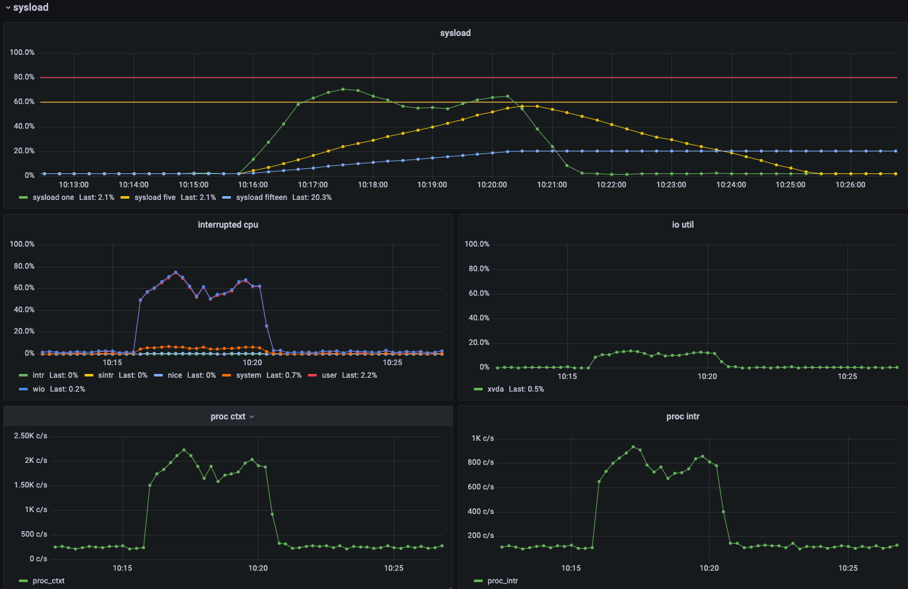

Sysload Exporter
---

Sysload exporter is prometheus style, go implementation of [gree/sysload](https://github.com/gree/sysload) .
Sysload is a metric that aims to measure system load as percentage instead of load average.For further information, Please refer to original description.


# usage

```
usage: sysload_exporter [<flags>]

Flags:
  -h, --help                    Show context-sensitive help (also try --help-long and --help-man).
      --debug                   Debug mode.
      --info                    show current information and exit
  -b, --target-block-devices=TARGET-BLOCK-DEVICES
                                Target block devices to track io utils
  -i, --target-network-devices=TARGET-NETWORK-DEVICES
                                Target network devices to check interrupting
      --listen-address=":9858"  The address to listen on for HTTP requests.
      --interrupted-threshold=40.0  
                                Threshold to consider interrupted cpu usage as sysload
      --refresh-rate=15         metrics refresh rate(should be 1 - 30)
      --path.procfs="/proc"     procfs mountpoint.
```

# try sysload in docker environment

run
```shell
#run sysload exporter and stress
docker-compose up -d
docker-compose exec sysload sh -c 'stress --cpu `grep -c processor /proc/cpuinfo`'

# in another terminal
watch 'curl -s localhost:9858/metrics |grep "^sysload"'
```

output is like below
```shell
sysload_io_util{device="vda"} 0
sysload_proc_ctxt 639.4666666666667
sysload_proc_intr 2219
sysload_si_cpu{mode="idle"} 0
sysload_si_cpu{mode="intr"} 0
sysload_si_cpu{mode="nice"} 0
sysload_si_cpu{mode="sintr"} 0
sysload_si_cpu{mode="system"} 0.20134228187919465
sysload_si_cpu{mode="user"} 99.79865771812081
sysload_si_cpu{mode="wio"} 0
sysload_sysload 100
sysload_sysload_fifteen 79.45156351127729
sysload_sysload_five 56.345939016162866
sysload_sysload_one 43.08324846990691

```

# grafana dashboard sample

- https://grafana.com/grafana/dashboards/15014


